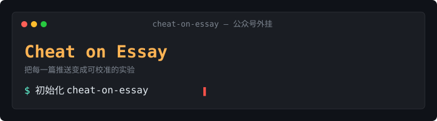

<h1 align="center">
  
</h1>

<h2 align="center">Cheat on Essay</h2>

<p align="center">
For WeChat Official Account writers — a skill that turns every essay into a calibrated experiment.
</p>

<p align="center">
You're reading this. The skill predicted it.<br>
It turns every "I feel this will go viral" into a calibrated experiment.<br>
It weaves every blind prediction, every top comment, every T+3d retro into a formula that's only yours.<br>
Your doubt — predicted too.
</p>

<p align="center">
  <strong>English</strong>
  &nbsp;·&nbsp;
  <a href="docs/README_CN.md"><strong>简体中文</strong></a>
</p>

<p align="center">
<a href="CHANGELOG.md"></a>
&nbsp;
<a href="LICENSE"></a>
</p>

---

## 🎬 What it actually does

Most WeChat OA writers live in the same gambling loop:

> Publish → Numbers come in → Learn nothing → Roll the dice again

A writer who's shipped 200 essays is barely 10% sharper than someone who's shipped 1 — because they never **kept books** after each round.

**Cheat on Essay** makes every judgment get logged, retrospected, absorbed into the next:

📊 7-dim score → 🏷️ Title A/B → 🎯 Blind-predict → 📐 Finalize → 🚀 Publish → 📈 T+3d retro → 🧬 Evolve your rubric

This isn't motivation. It's **compounding** — every piece you don't retro is silently eroding your ability to see yourself.

One month in = you have a hit-formula that's **only yours**.
Three months in = you're 10× sharper than your first-day self.

---

## 🌀 Origin

This is the sibling repo of [cheat-on-content](https://github.com/XBuilderLAB/cheat-on-content) (video version). Same methodology — score → blind predict → retro → evolve rubric — ported to WeChat long-form essays.

But **the rubric had to be rewritten**: videos hinge on completion rate and emotional resonance (ER/HP/QL/NA/AB/SR/SAT 7 dims), essays hinge on title hooks and issue edge. This version reimagines the 7 dims:

- **TH** Title Hook (drives 40% open rate)
- **OP** Opening Pull (drives early completion)
- **IE** Issue Edge (drives 30% engagement)
- **EG** Emotional Granularity (drives 20% share)
- **SR** Structural Rhythm (completion-rate floor)
- **QD** Quote Density (Moments screenshot driver)
- **AE** Action Exit (follower conversion + engagement)

---

## ⚖️ How it differs from other "creator tools"

| Others | This |
|---|---|
| Give you "inspiration" | Make **your own intuition** measurable |
| AI writes for you | AI **judges** for you — the script stays yours |
| Ship 3 title A/B variants | Ship one — **bet** in writing, settle the books with data |
| Static dashboard | An **evolving rubric** — your formula 3 months from now isn't the starting one |
| AI generates titles | AI **scores YOUR title candidates** — judgment object must be yours |

In a sentence: other tools help you "ship more." This helps you "judge sharper."

---

## 🤔 Can't I just use ChatGPT / DeepSeek / Doubao?

Those are **general assistants** — they tell everyone the same thing. You ask "will this go viral?" and the answer is fitted to global average opinion, not your channel. Ask again tomorrow — same answer. **It doesn't remember you. It doesn't change because of you.**

This is **your own ops expert** — serving only your one WeChat OA:

- The scoring formula is reverse-engineered from **your** history, not the global training distribution
- Every piece you ship updates its understanding — by month three, judgment accuracy is 10× sharper than day one (**auto-evolving**)
- It knows your benchmark account, your cadence, the last three reasons you flopped — things ChatGPT forgets after the first reply

General LLMs help everyone. This helps **your** account.

---

## 🛡️ Why the loop actually evolves

📝 **Every piece is logged**: Score, prediction, title-AB scores, publish-timing get written before publish, archived end-to-end. Three days later you settle accounts — you see exactly where you were sharp, where you were off. No more vague "I feel this one didn't land."

🔁 **It gets sharper**: Three same-direction misses in a row OR one ≥10x extreme deviation, the tool actively prompts you to upgrade your scoring formula. **You don't have to remember — it remembers for you.**

🛡️ **Upgrades have a brake**: Switching the formula requires re-scoring all historical samples — only released if it ranks more accurately than the old. Plus a cross-model independent audit — **so you can't fool yourself.**

🪒 **The rubric is a workbench, not a museum**: Observations refuted by data get deleted; observations absorbed into formal dimensions also get deleted. It only holds what's most useful right now.

---

## 📦 Install

```bash
git clone https://github.com/<your-org>/cheat-on-essay.git
cd cheat-on-essay
bash install.sh
```

14 sub-skills are symlinked into your agent's skill directory. One install, every essay project gets it.

**Supported agents**: Claude Code (default) · Codex (`bash install.sh --codex`) · Both (`bash install.sh --all`)

> Frozen version: `bash install.sh --copy` / `bash install.sh --codex --copy`
>
> Uninstall: `bash uninstall.sh` / `bash uninstall.sh --codex` (your content data is not touched)

---

## 🚀 First run

In your essay project directory, open a skill-compatible agent and say:

```
初始化 cheat-on-essay
```

(or `init cheat-on-essay`)

5-6 yes/no questions complete onboarding. **Strongly recommend importing a benchmark account** — 5–10 essays and the tool gets an anchor immediately. Without one, your first 5 predictions land at ±50% precision.

---

## ⚡ Daily use

```
score this drafts/<...>.md            → 7-dim grade only
extract quotes drafts/<...>.md        → 5-dim virality score + quote candidate library
start prediction drafts/<...>.md      → 7 dims + title A/B + publish timing + blind prediction
finalize drafts/<...>.md              → build article folder; ≥30% script-diff triggers v2 reprediction
shipped https://mp.weixin.qq.com/s/...  → buffer -1
retro articles/<...>/                 → T+3d 6 numbers + 20 comments + retrospective
status / fetch trends / find topic / bump rubric / find benchmark
```

Hook-aware agents auto-report buffer + pending retros + top candidates at every session start — no need to ask. Other agents: just say `status`.

Full workflow + sub-skill details: see [SKILL.md](SKILL.md).

---

## ⚠️ Rubric applicability boundary (must-read)

v0 is designed for **opinion / industry-analysis / deep-knowledge / personal-narrative long-form essays** (1k-5k 字).

| Form | Rubric applicability |
|---|---|
| Opinion / commentary / industry analysis | ✅ Fully applicable |
| Deep knowledge / long-form science | ✅ Fully applicable |
| Personal narrative / emotional storytelling | ✅ Fully applicable |
| Tutorial / how-to / tool sharing | ⚠️ Partial (IE dim suggested N/A) |
| News flash / hot-take commentary | ⚠️ Partial (rubric doesn't capture timing + audience-size + recommendation-flow boost) |
| < 500 字 short-message cards | ❌ Not applicable |
| Image-album-dominant / pure marketing copy | ❌ Not applicable |

Tool still runs, but score explanatory power degrades — see [DECISIONS.md](DECISIONS.md) §5 and [docs/sample-calibration-v0.1.0.md](docs/sample-calibration-v0.1.0.md) for sample calibration analysis.

---

## 📊 Data retro needs from you

v0.1.0 defaults to **manual paste** — WeChat OA ecosystem has no usable free third-party API.

At retro time, copy from the OA backend:

```
✅ Reads (total)
✅ "Looking at" count + Likes
✅ Shares
✅ New followers (24h or 48h)
🟡 Completion rate (if backend shows)
✅ Top 20 comments (with like counts)
```

Backend path: WeChat mobile → 订阅号助手 → Data → Content Analysis. Or `mp.weixin.qq.com` → Data Analysis → Content Analysis.

**Comments are the real signal** — "share rate 8%" can't tell you why, but 20 comments' keywords can. The retro tool will refuse if you give fewer than 5 comments.

Future v0.2 candidates: integrate with NewRank / 西瓜助手 etc. paid third-party APIs.

---

## 📈 Star History

<a href="https://star-history.com/#<your-org>/cheat-on-essay&Date">
  /cheat-on-essay&type=Date" alt="Star History Chart" width="720">
</a>

---

## 📜 License

MIT. Commercial use, modification, closed-source integration — all fine.

---

*Is this cheating? So was the calculator. So was Google.*
*The future doesn't reward effort — it rewards those who see the pattern first.*

*You reading this line — that's predicted too.*
